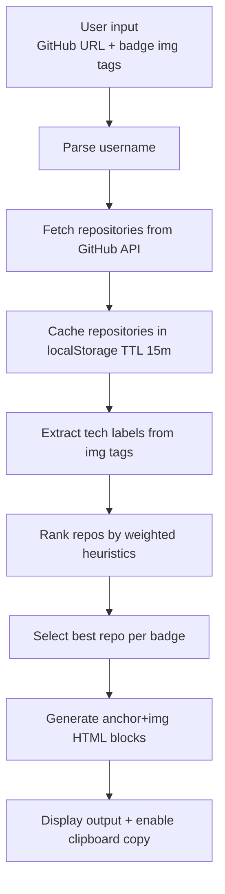

# GitHub Badge Linker

Convert raw Shields-style `` badge tags into repository-linked snippets in one pass.

[](LICENSE)
[](#tech-stack--architecture)
[](#tech-stack--architecture)
[](#tech-stack--architecture)
[](#features)

> [!NOTE]
> This project is a client-side utility that runs entirely in the browser. No backend service is required for runtime processing.

## Table of Contents

- [Title and Description](#github-badge-linker)
- [Table of Contents](#table-of-contents)
- [Features](#features)
- [Tech Stack & Architecture](#tech-stack--architecture)
- [Getting Started](#getting-started)
- [Testing](#testing)
- [Deployment](#deployment)
- [Usage](#usage)
- [Configuration](#configuration)
- [License](#license)
- [Support the Project](#support-the-project)

## Features

- Parses pasted HTML badge snippets and extracts `` tags automatically.
- Converts each badge image into clickable anchor markup suitable for `README.md` profiles.
- Uses GitHub repository metadata to rank and auto-match badges to the most relevant repository.
- Supports heuristic technology alias matching (for example, `js` → `javascript`, `next` → `nextjs`, `gh-pages` → `githubpages`).
- Falls back gracefully to the most recently active repository if no direct technology match is found.
- Caches GitHub repository API responses in `localStorage` with TTL-based invalidation (15 minutes).
- Persists form state locally so user input survives refreshes.
- Includes multilingual UI support with strict translation-key validation at load time.
- Supports language switching via a runtime locale selector.
- Provides clipboard copy of generated result output with status feedback.
- Implements robust UX messaging for invalid profile URL, empty repository list, missing `` tags, copy failure, and API errors.
- Works as static assets only (`index.html` + JS + CSS + locale dictionaries), so it can be hosted on any static platform.

> [!TIP]
> The matcher scores repositories using language, topics, name, description, homepage, stars, fork status, and recent push activity; this generally produces better links than simple keyword-only matching.

## Tech Stack & Architecture

### Core Stack

- **Language:** Vanilla JavaScript (ES Modules)
- **UI Layer:** Semantic HTML5
- **Styling:** Plain CSS3
- **Internationalization:** Dictionary-based locale modules
- **External Runtime Dependency:** GitHub REST API (`/users/{username}/repos`)
- **CI Security/Linting:** GitHub Actions (Super-Linter + CodeQL)

### Project Structure

```text
badge-link-automator/
├── .github/
│   ├── dependabot.yml
│   └── workflows/
│       ├── codeql.yml
│       ├── dependabot-auto-merge.yml
│       └── lint.yml
├── assets/
│   ├── css/
│   │   └── styles.css
│   ├── i18n/
│   │   ├── index.js
│   │   └── *.js (locale dictionaries)
│   └── js/
│       └── app.js
├── index.html
├── LICENSE
└── README.md
```

### Key Design Decisions

- **Browser-first architecture:** keeps operations local and minimizes operational overhead.
- **Heuristic matching over static mapping:** improves flexibility across varied badge label formats.
- **TTL caching in browser storage:** reduces API calls and improves responsiveness during iterative edits.
- **Translation key validation on startup:** fails fast when locale dictionaries drift.
- **Progressive status feedback:** improves usability for non-technical contributors editing profile READMEs.



> [!IMPORTANT]
> Repository ranking is heuristic, not deterministic truth. Always review generated links before publishing your final `README.md`.

## Getting Started

### Prerequisites

- Modern browser with ES Module support (Chrome, Firefox, Edge, Safari).
- Internet access to reach `api.github.com` for repository discovery.
- Optional: `git` for local clone-based development.

### Installation

```bash
git clone https://github.com/<your-org-or-user>/badge-link-automator.git
cd badge-link-automator
```

Run locally (static server example):

```bash
python3 -m http.server 8080
# Open http://localhost:8080
```

Alternative quick start:

```bash
# Open index.html directly in your browser
# (static hosting recommended for consistent module loading behavior)
```

## Testing

This repository currently does not ship a dedicated unit/integration test harness. Validation is primarily static-analysis and manual functional checks.

### Lint and Static Analysis

```bash
# Run equivalent checks locally if available in your environment
npx super-linter
```

### Manual Functional Validation

1. Launch the app in a browser.
2. Enter a valid GitHub profile URL.
3. Paste multiple `` badge tags.
4. Generate result output and verify `<a href="...">` wrappers.
5. Click copy and confirm clipboard content.
6. Change language and confirm translated UI text appears correctly.

> [!WARNING]
> GitHub API rate limits apply for unauthenticated requests. If you process many profiles quickly, wait for reset or add authenticated request handling in a future enhancement.

## Deployment

### Production Hosting

Because the app is static-only, deploy it to any static hosting provider:

- GitHub Pages
- Netlify
- Vercel (static output)
- Cloudflare Pages
- S3 + CloudFront

### Deployment Checklist

1. Ensure `index.html` and `assets/` are published together.
2. Preserve directory structure so module imports resolve correctly.
3. Enforce HTTPS so clipboard and browser APIs work consistently.
4. Optionally add cache headers for static assets.

### CI/CD Integration

The repository includes:

- Super-Linter workflow for code quality and format policy checks.
- CodeQL workflow for security/code scanning.
- Dependabot + auto-merge workflow for safe dependency and action updates.

## Usage

### Basic Workflow

```html
<!-- Input badges pasted into the app textarea -->


```

Example generated output pattern:

```html
<a href="https://github.com/username/project-js" target="_blank">
  
</a>

<a href="https://github.com/username/project-next" target="_blank">
  
</a>
```

### Programmatic Initialization Notes

The app initializes after `DOMContentLoaded`, then:

1. Renders locale options.
2. Restores cached form data.
3. Applies selected locale.
4. Registers listeners for form persistence and locale switching.

> [!CAUTION]
> Generated HTML includes `target="_blank"`. If embedding elsewhere, consider adding `rel="noopener noreferrer"` based on your security policy.

## Configuration

### Browser Storage Keys

| Key | Purpose | Default Behavior |
| --- | --- | --- |
| `badge_linker_language` | Stores selected locale code. | Falls back to `en` if invalid/unsupported. |
| `badge_linker_form_cache` | Stores `githubUrl`, badge input, and output text. | Loaded on startup; invalid JSON is discarded. |
| `badge_linker_repo_cache` | Stores fetched repos per username with timestamp. | Expires entries after 15 minutes. |

### Runtime Constants

| Constant | Value | Role |
| --- | --- | --- |
| `REPO_CACHE_TTL_MS` | `15 * 60 * 1000` | Cache lifetime for repo metadata. |
| `DEFAULT_LOCALE` | `en` | Fallback language. |

### Extending Locales

1. Add a new locale file under `assets/i18n/`.
2. Export a dictionary with keys matching the default locale.
3. Register it in `assets/i18n/index.js` (`TRANSLATIONS` and `LOCALE_OPTIONS`).
4. Reload app; key validation will throw if dictionaries are inconsistent.

### Environment Variables and Startup Flags

- No `.env` file is required.
- No server-side startup flags are required.
- If you introduce a build pipeline later, document env vars and CLI flags in this section.

## License

This project is licensed under the Apache License 2.0. See `LICENSE` for full legal terms.

## Support the Project

[](https://www.patreon.com/OstinFCT)
[](https://ko-fi.com/fctostin)
[](https://boosty.to/ostinfct)
[](https://www.youtube.com/@FCT-Ostin)
[](https://t.me/FCTostin)

If you find this tool useful, consider leaving a star on GitHub or supporting the author directly.
